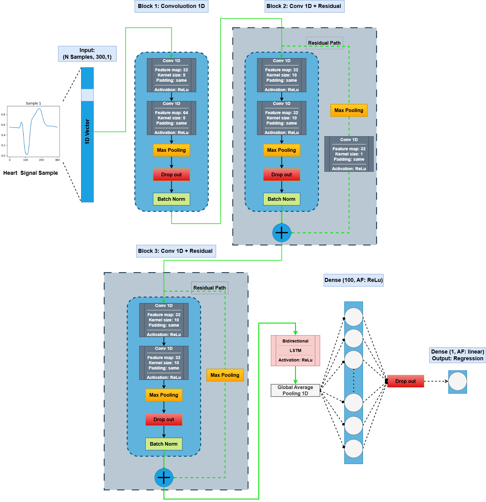
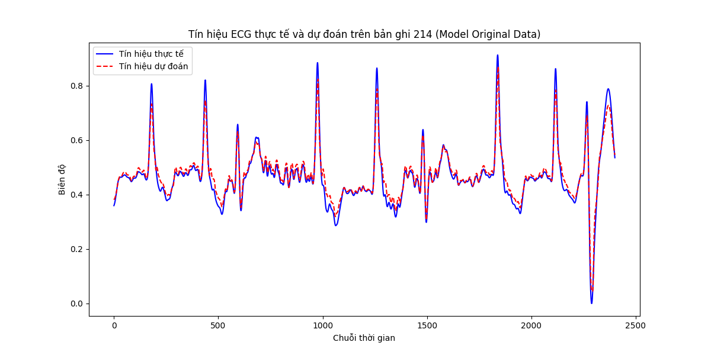
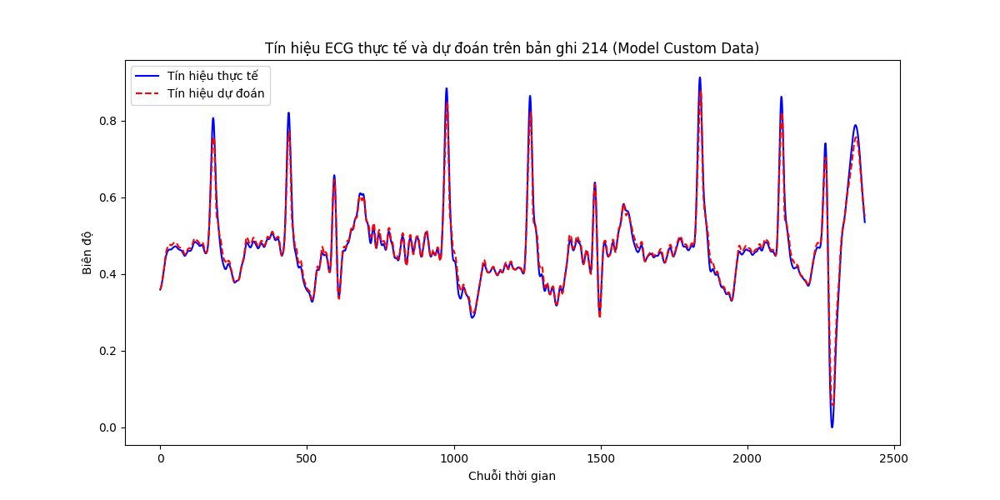
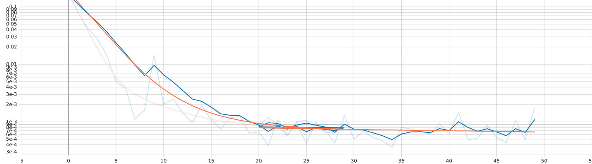
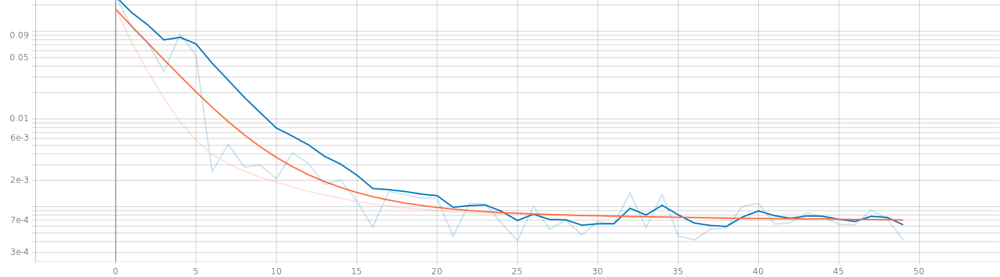
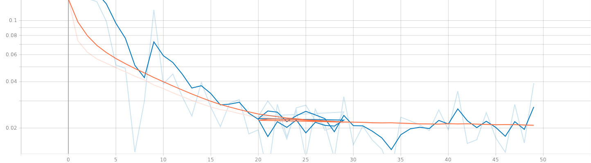
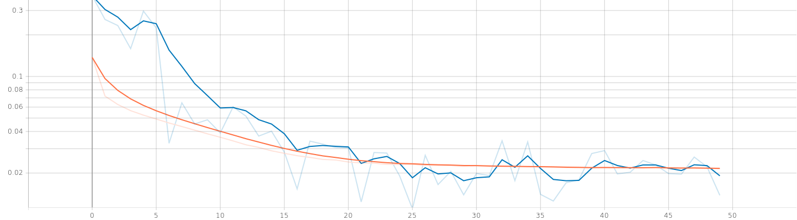
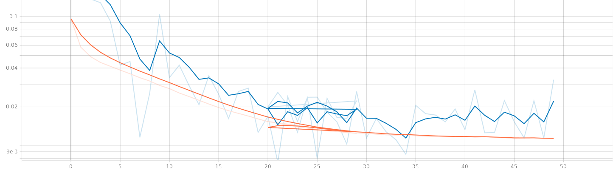
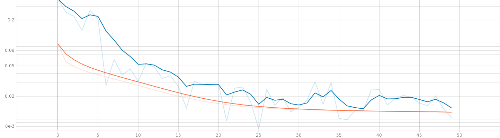

# ECG Signal Reconstruction with 1D CNN-BiLSTM

This project implements a 1D CNN-BiLSTM model for reconstructing ECG signals, focusing on improving signal reconstruction accuracy by leveraging a custom dataset with augmented abnormal samples. The model is trained on two datasets: the original MIT-BIH Arrhythmia dataset and a custom dataset with enhanced abnormal signals. The performance is evaluated using metrics such as MSE, MAE, RMSE, and R², and the training process is visualized using TensorBoard.

## Project Overview
The goal of this project is to reconstruct ECG signals using a hybrid 1D CNN-BiLSTM model. The model consists of:
- **Residual CNN blocks**: Extract spatial features from raw ECG signals.
- **Bi-LSTM layers**: Capture temporal dependencies in the signal.
- **Dense layer**: Reconstruct the final ECG signal.

Two datasets are used for training:
- **Original Dataset**: Raw ECG signals from the MIT-BIH Arrhythmia database.
- **Custom Dataset**: Augmented dataset with additional abnormal samples to improve model generalization.

The model is evaluated on a test set (ECG-102) and an additional record (Record 214) to assess its generalization ability.

## Model Architecture
The architecture of the 1D CNN-BiLSTM model is illustrated below:



- **Input**: Raw ECG signal (1D array).
- **CNN Blocks**: Residual convolutional layers to extract spatial features.
- **Bi-LSTM**: Bidirectional LSTM layers to model temporal dependencies.
- **Dense Layer**: Fully connected layer for signal reconstruction.

## Results
### Performance Metrics
The model was trained on both datasets, and the performance was evaluated on a test set (ECG-102). The results are summarized below:

| Metric | Original Dataset | Custom Dataset |
|--------|------------------|----------------|
| MSE    | 0.0007           | 0.0002         |
| MAE    | 0.0186           | 0.0108         |
| RMSE   | 0.0256           | 0.0140         |
| R²     | 0.9839           | 0.9952         |

**Additional Evaluation on Record 214** (30,000 data points from MIT-BIH Arrhythmia):

| Metric | Original Dataset | Custom Dataset |
|--------|------------------|----------------|
| MSE    | 0.0005           | 0.0002         |
| MAE    | 0.0146           | 0.0086         |
| RMSE   | 0.0220           | 0.0146         |
| R²     | 0.9568           | 0.9810         |

### Reconstructed Signals on Record 214
The reconstructed ECG signals on Record 214 are visualized below, comparing the actual signal with the reconstructed signal from both models.

  
*Reconstructed ECG signal on Record 214 by the model trained on the original dataset*

  
*Reconstructed ECG signal on Record 214 by the model trained on the custom dataset*

### Training Process (TensorBoard Visualizations)
The training process was monitored using TensorBoard, showing the loss, RMSE, and MAE over 50 epochs for both datasets.

#### Loss
  
*Loss of Epochs on Original Dataset*

  
*Loss of Epochs on Custom Dataset*

#### RMSE
  
*RMSE over Epochs on Original Dataset*

  
*RMSE over Epochs on Custom Dataset*

#### MAE
  
*MAE over epochs on data origin*

  
*MAE over epochs on data custom*

### Key Findings
- The model trained on the custom dataset outperforms the model trained on the original dataset across all metrics, with lower errors (MSE, MAE, RMSE) and a higher R² score.
- The custom dataset, with augmented abnormal samples, enables the model to learn more diverse and complex features, leading to better generalization (as seen in Record 214).
- TensorBoard visualizations show faster convergence and better stability on the custom dataset, especially on the validation set.
- The reconstructed signals on Record 214 demonstrate that the model trained on the custom dataset better captures complex patterns, especially in abnormal segments, compared to the model trained on the original dataset.
- TensorBoard visualizations show faster convergence and better stability on the custom dataset, especially on the validation set

## Thesis Document
This project is part of my undergraduate thesis and scientific research. The full thesis document (in Vietnamese) is available here:  
[Thesis PDF](doc/thesis.pdf)

"Please cite this thesis if you use it in your work: Phan Anh, 'ECG Signal Reconstruction with CNN-BiLSTM', Van Lang University, 2025."

## How to Run
### Prerequisites
- Python 3.8+
- Required libraries: `tensorflow`, `numpy`, `pandas`, `matplotlib`, `tensorboard`
- Install dependencies:
  ```bash
  pip install -r requirements.txt
  ```

### Dataset
- Place the original and custom ECG datasets in the `data/processed` directory:
  - `data/processed/data_102_filtered_100k.csv`: Original MIT-BIH Arrhythmia dataset.
  - `data/processed/custom_training_dataset.csv`: Custom dataset with augmented abnormal samples.
  - `data/processed/data_214_30k_filtered.csv`: Record 214 for evaluation.

### Training
1. Train the model on both datasets:
   ```bash
   python train_model.py --data_102_filtered_100k.csv
   python train_model.py --custom_training_dataset.csv
   ```
2. Monitor the training process using TensorBoard:
   ```bash
   tensorboard --logdir logs/tensonboard_logs/  # For original data
   tensorboard --logdir logs_customdata/tensonboard_logs/  # For custom data
   ```

### Evaluation
- The trained models will be saved in the `logs/ECG_best_weight` directory.
- Evaluate the models on the test set and Record 214:
  ```bash
  python evaluate_model.py --model logs/ECG_best_weight/weights-best-epoch-40.weights.h5 --test_data data/processed/data_214_30k_filtered.csv  # Model trained on original data
  python evaluate_model.py --model logs_customdata/ECG_best_weight/weights-best-epoch-50.weights.h5 --test_data data/processed/data_214_30k_filtered.csv  # Model trained on custom data
  ```

## Contact
For any questions or contributions, feel free to reach out:
- Email: pnhatanh71@gmail.com
- GitHub Issues: [[Create an issue](https://github.com/your-username/your-repo/issues)](https://github.com/PhanAnh-DS-AI/APPLICATION-OF-AI-IN-EARLY-WARNING-OF-HEART-RHYTHM-DISORDERS-ECG-/issues)
